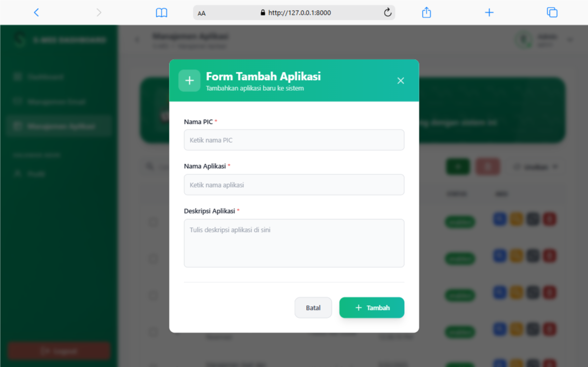

# 📧 Email Service Web

Sistem manajemen pengiriman email berbasis web dengan antrian prioritas menggunakan RabbitMQ, Laravel, dan Vue.js.

---

## 🚀 Fitur Utama

-   **Pengiriman Email Massal**: Kirim email satuan/manual atau massal via upload file Excel.
-   **Antrian Prioritas**: Email diproses berdasarkan prioritas (high, medium, low) menggunakan RabbitMQ.
-   **Log & Monitoring**: Pantau status pengiriman email (success, failed, pending) secara real-time.
-   **Integrasi Multi-Aplikasi**: Setiap aplikasi memiliki secret key unik untuk keamanan dan tracking.
-   **Retry & Error Handling**: Kirim ulang email yang gagal dengan mudah, lengkap dengan notifikasi error.
-   **Dashboard Analitik**: Statistik visual pengiriman email, tingkat keberhasilan, dan kegagalan.

---

## 🛠️ Teknologi

-   **Backend**: Laravel 10+, PHP 8+, RabbitMQ, MySQL/MariaDB
-   **Frontend**: Vue 3, Inertia.js, TailwindCSS
-   **Queue**: RabbitMQ (dengan dukungan prioritas)
-   **Excel Import**: Maatwebsite/Laravel-Excel

---

## ⚙️ Arsitektur

```
[User] → [Vue.js SPA] → [Laravel API] → [RabbitMQ Queue] → [Email Engine Worker] → [SMTP/SES/Resend]
```

-   **SPA**: UI modern, responsif, dan real-time.
-   **API**: Endpoint RESTful untuk pengiriman, log, dan manajemen aplikasi.
-   **Queue**: RabbitMQ untuk antrian email dengan prioritas.
-   **Worker**: Konsumen queue yang mengirim email dan update status log.

---

## 📝 Cara Pakai

-   **Login** sebagai user/supervisor.
-   **Tambah aplikasi** untuk mendapatkan secret key.
-   **Kirim email** manual atau upload file Excel.
-   **Pantau status** di dashboard & log.
-   **Kirim ulang** email yang gagal langsung dari log.

---

## 📊 Dashboard

-   Statistik email terkirim/gagal/total.
-   Grafik performa pengiriman.
-   Ringkasan persentase keberhasilan.

---

## 🔒 Keamanan

-   Setiap aplikasi memiliki secret key unik.
-   Validasi input & file attachment.
-   Hanya aplikasi aktif yang dapat mengirim email.

---

## 🖼️ Screenshot Hasil Website

### 🔑 Login

<table>
  <tr>
    <td></td>
    <td></td>
  </tr>
</table>

### 🎛️ Admin

<table>
  <tr>
    <td></td>
    <td></td>
  </tr>
  <tr>
    <td></td>
    <td></td>
  </tr>
  <tr>
    <td></td>
    <td></td>
  </tr>
  <tr>
    <td></td>
    <td></td>
  </tr>
</table>

### 🧑‍💼 Supervisor

<table>
  <tr>
    <td></td>
    <td></td>
  </tr>
  <tr>
    <td></td>
    <td></td>
  </tr>
</table>

### 👤 Profil

<table>
  <tr>
    <td></td>
    <td></td>
  </tr>
</table>
